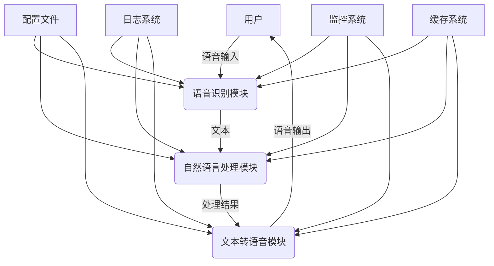
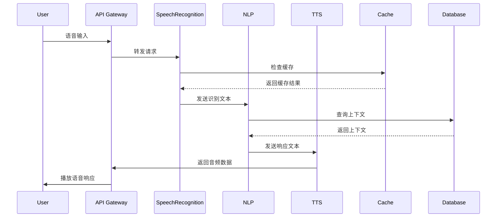

# 系统架构概述

## 架构图

## 分层架构

### 1. 接入层
- 负责处理用户请求
- 负载均衡
- 请求路由
- 身份验证

### 2. 业务逻辑层
- 语音识别服务
- 自然语言处理服务
- 文本转语音服务
- 对话管理服务

### 3. 数据层
- 用户数据存储
- 对话上下文存储
- 语音数据缓存
- 日志存储

### 4. 基础设施层
- 消息队列
- 缓存系统
- 监控系统
- 日志系统

## 主要模块

### 1. 语音识别模块
- 实时音频流处理
- 支持多语言识别
- 自动语音检测
- 噪声消除
- 支持自定义词汇

### 2. 自然语言处理模块
- 意图识别
- 实体提取
- 上下文管理
- 对话状态跟踪
- 多轮对话支持

### 3. 文本转语音模块
- 多语音风格支持
- 情感语音合成
- 实时音频流输出
- 音频质量优化
- 多语言发音支持

## 数据流

## 性能指标

| 指标 | 目标值 | 说明 |
|------|--------|------|
| 响应时间 | < 2s | 端到端响应时间 |
| 识别准确率 | > 95% | 语音识别准确率 |
| 并发用户 | 100+ | 同时支持的用户数量 |
| 系统可用性 | 99.99% | 系统正常运行时间 |
| 吞吐量 | 1000 TPS | 每秒处理请求数 |

## 扩展性设计

- 微服务架构
- 容器化部署
- 自动扩缩容
- 服务发现
- 配置中心
- 分布式追踪

## 可靠性设计

- 服务熔断
- 限流降级
- 数据备份
- 故障转移
- 自动恢复

## 安全性设计

- 数据加密
- 访问控制
- 身份验证
- 日志审计
- 漏洞扫描
