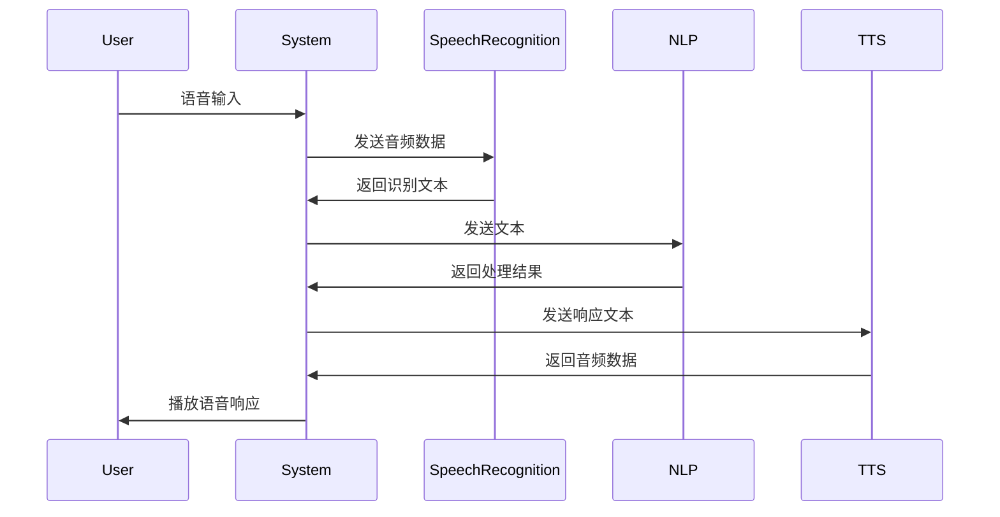

# 业务逻辑与工作流程

## 核心业务流程

## 主要业务模块

### 1. 语音识别流程

1. 接收用户语音输入
2. 预处理音频数据
3. 调用语音识别API
4. 处理识别结果
5. 返回识别文本

### 2. 自然语言处理流程

1. 接收识别文本
2. 分析用户意图
3. 生成上下文
4. 调用语言模型
5. 生成响应文本

### 3. 文本转语音流程

1. 接收响应文本
2. 选择语音风格
3. 调用TTS API
4. 处理音频数据
5. 返回音频文件

## 业务规则

### 语音识别规则

- 支持多语言识别
- 自动检测语言
- 实时流式处理
- 支持自定义词汇

### 对话管理规则

- 维护对话上下文
- 支持多轮对话
- 处理中断和恢复
- 管理对话状态

### 响应生成规则

- 根据上下文生成响应
- 支持多种响应模式
- 处理敏感信息
- 支持个性化设置

## 异常处理

### 语音识别异常

- 音频质量差
- 网络连接中断
- API调用失败
- 识别结果不准确

### 对话异常

- 上下文丢失
- 意图识别错误
- 响应超时
- 敏感内容检测

### 系统异常

- 资源不足
- 配置错误
- 依赖服务不可用
- 硬件故障

## 性能要求

| 指标 | 目标值 | 说明 |
|------|--------|------|
| 响应时间 | < 2s | 端到端响应时间 |
| 识别准确率 | > 95% | 语音识别准确率 |
| 并发支持 | 10+ | 同时在线用户数 |
| 系统可用性 | 99.9% | 系统正常运行时间 |
