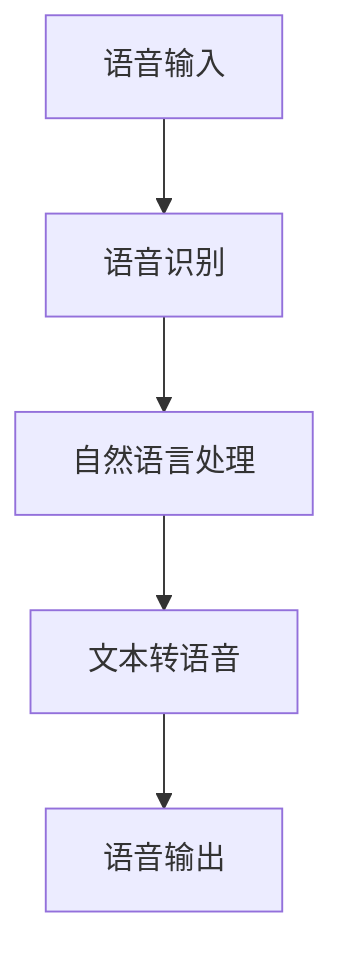

# Raspberry Gemini Voice


基于树莓派的智能语音交互系统，集成语音识别、自然语言处理和文本转语音功能。

## 主要功能

- 🎙️ 实时语音识别
- 🤖 自然语言处理
- 🔊 高质量文本转语音
- 🛠️ 模块化架构
- 📦 易于部署

## 快速开始

```bash
# 克隆项目
git clone https://github.com/yourusername/raspberry-gemini-voice.git

# 安装依赖
pip install -r requirements.txt

# 启动系统
python src/main.py
```

## 系统架构



## 贡献指南

欢迎贡献！请阅读我们的[贡献指南](contributing.md)

## 许可证

本项目采用 [MIT 许可证](LICENSE)
